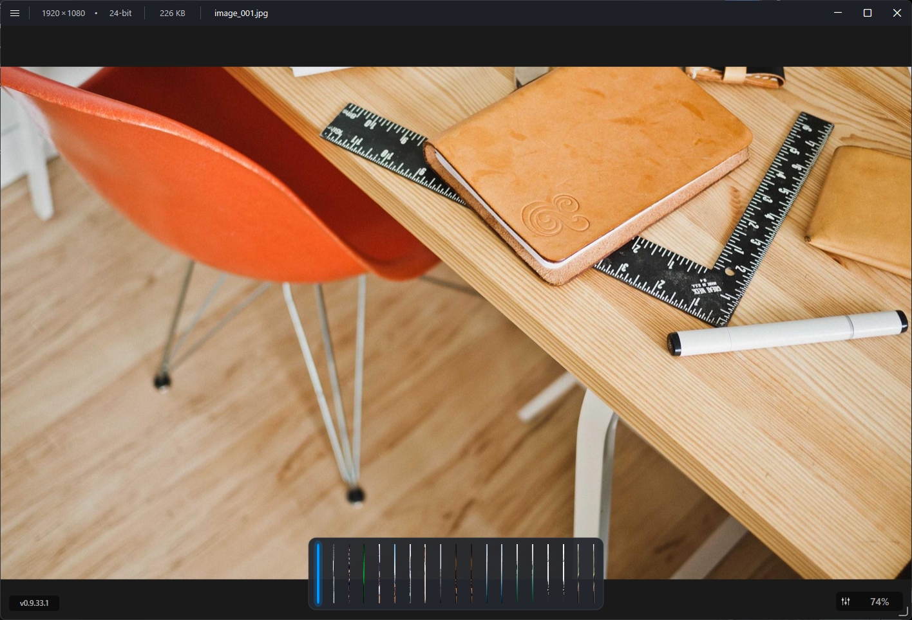
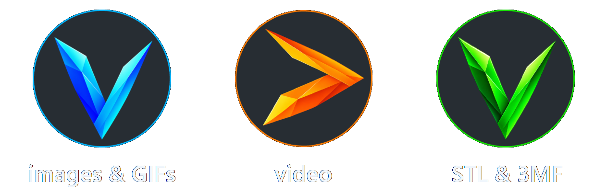

<p align="center">
  
</p>

<h1 align="center">viewtrious</h1>

<p align="center">
  <strong>no accounts. no cloud. just a media viewer.</strong>
</p>

<p align="center">
  
</p>

viewtrious is an extremely lightweight media viewer for Windows 11 built around fast launch, direct presentation, and a small footprint rather than a media-library workflow.

the base viewer uses Windows-native graphics, media, shell, and persistence components wherever practical. it has no background service, does not require a bundled codec framework, and keeps the main viewing experience local to the machine.

## media families

<p align="center">
  
</p>

## highlights

- native C++20 / Win32 application
- fast same-folder navigation with a filmstrip that follows the selected media
- media adjustment panel with Exposure, Brightness, Contrast, Shadows, Highlights, Saturation, and Sharpness
- deterministic auto adjustments, user presets, and optional per-media adjustment persistence
- media-aware custom context menus and Windows-native file associations
- per-user settings and adjustment data stored in WinSQLite under `%LOCALAPPDATA%\viewtrious\data`
- 3Dconnexion SpaceMouse support for Model3D navigation

## images videos and GIFs

viewtrious uses Windows Imaging Component (WIC) for still-image decoding and supports the common formats exposed through its current Windows integration, including JPEG, PNG, BMP, HEIC/HEIF, DNG, and GIF. Video playback uses Windows Media Foundation and the existing Direct3D/Direct2D presentation path.

- safe JPEG/PNG rotation
- content-hash-backed adjustment persistence without modifying the original media
- animated GIF playback with play/pause and frame stepping
- set as Desktop Background

## 3D

model3D supports **STL and 3MF**.

- 3Dconnexion SpaceMouse navigation
- orthographic/perspective control on the canvas
- configurable Build Plate and grid
- standard 3MF colors plus supported slicer material/color metadata
- multi-part/component hierarchy with synchronized viewport selection
- resilient loading of referenced 3MF model parts

## settings and data

viewtrious utilizes Windows system WinSQLite database:

```text
%LOCALAPPDATA%\viewtrious\data\viewtrious.db
```

the database contains application settings, image/video adjustment state, and the file-hash cache used to reconnect adjustments after rename or move.

user-created exports such as saved video frames live under `Pictures\viewtrious`.

## build from source

### prerequisites

- Windows 11
- Visual Studio Build Tools with the **Desktop development with C++** workload
- a Windows SDK containing the C++/WinRT projection
- CMake 3.21 or newer
- Ninja
- 3Dconnexion 3DxWare SDK 4

from a Developer PowerShell for Visual Studio:

```powershell
cmake -S . -B out/debug -G Ninja -DCMAKE_BUILD_TYPE=Debug -DVIEWTRIOUS_3DXWARE_SDK_ROOT="C:\path\to\3DxWare_SDK"
cmake --build out/debug

cmake -S . -B out/release -G Ninja -DCMAKE_BUILD_TYPE=Release -DVIEWTRIOUS_3DXWARE_SDK_ROOT="C:\path\to\3DxWare_SDK"
cmake --build out/release
```

the canonical release executable is:

```text
out\release\Viewtrious.exe
```

debug builds emit selected startup and frame-pacing diagnostics to the debugger output. Release builds compile that instrumentation out.

## architecture

the base viewer is built from:

- Win32
- Windows Imaging Component
- Direct2D
- Direct3D 11 / DXGI
- Windows Media Foundation
- Windows.UI.Composition
- WinSQLite
- 3Dconnexion NavLib integration
- miniz for ZIP/DEFLATE access used by 3MF packaging

the project intentionally avoids heavyweight media/CAD frameworks in the base application.

## Licensing

viewtrious is **source-available** under the **Apache License 2.0 with the Commons Clause License Condition v1.0**.

source may be viewed, modified, and redistributed subject to those terms. The Commons Clause restricts selling viewtrious itself, or a product or service whose value derives entirely or substantially from viewtrious functionality, as defined by the clause. commercial and internal business use are not categorically prohibited.

see [LICENSE](LICENSE) for the controlling terms.

Copyright 2026 Dustin Wilson<br>
Published under the ortrious brand

Third-party components retain their own licenses and attribution requirements.
